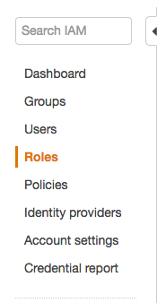

# Creating and Deploying Serverless Architectures on AWS.

# Part 0: History

Intrepid prides itself on its ability to quickly train new talent through the company's apprentice program. Int his program, new programmers who may not have mobile development experience take a deep dive into the platform of their choice and get hands on experience by working on several projects. The first project they do is a solo project aimed at easing them into the environment at their own pace. In the past, their first app would be either a full UI based app, or one that worked against an existing API.

More recently, we had decided to try something new and teach MVP and MVVM patterns right from the start with their initial project. Thus, PickPocket was born as a fun way to introduce these concepts. PickPocket would be a small game based around Mastermind that would help us teach concepts like MVP, Retrofit, and Recycler Views. However, as this was a brand new custom app, this would mean we needed a backend to test against.

Armed with Python experience, a free tier AWS account, and vaguely remembering that AWS Lambda's existed, we spent a few weekends throwing together a backend for the new project.

This posting is broken up into two main parts. In the first section we talked about deploying everything manually the way we initially built out this system. In part two we'll show you how to leverage cloud formation to quickly and automatically deploy the environments and allow the lambdas to be managed through source control.

## The downsides of manual Deployment

In the first blog post we showed you how to configure the entire backend through the AWS GUI. This works great at first, but managing these lambdas became difficult. There was no way to track changes or get code reviews on the work we were doing. Adding a new lambda was also a fairly tedious and repetitive task.

# Part 2: Cloud formation

Cloud formation is AWS's tool for quickly provisioning and deploying new combinations of AWS Resources. Best of all, there is no additional cost of using Cloud Formation, you only pay for the resources that are created (if they are outside of the free tier). Cloud Formation works off of profiles that are generated using JSON or YAML and then launched using the AWS Command Line interface. They can also be made dynamic so that you can share the stack with others just by sending them the JSON file. In this walkthrough we'll show you how to manually create a Cloud Formation document and then walk you through using a python script we created to expedite and automate parts of the process.

* Note This tutorial Assumes you have AWS CLI configured on your local machine. TODO Find a link to walkthrough how to do this.

## i. Lambda

In this exercise, we'll build a single lambda/database/resource/method configuration, similar to how we did the last tutorial. First let's see how to upload a lambda using cloud formation. Create a new file called `deploy.json` and copy this into it.

```Javascript
{
    "Resources": {
      "CreateUserCLOUDFORM": {
        "DependsOn": "LambdaRole",
          "Properties": {
              "Code": {
                  "ZipFile": "import json\nimport boto3\nimport decimal\nfrom boto3.dynamodb.conditions import Key, Attr\n\n\"\"\"\nJSON Format:\n    \"userId\":\"JohnM\",\n    \"displayName\":\"John Mack\",\n    \"combination\":\"[1,2,3,4]\"\n\"\"\"\nvalidDigits = [1, 2, 3, 4, 5, 6]\n\ndef lambda_handler(event, context):\n    output = {}\n    dynamodb = boto3.resource('dynamodb')\n    table = dynamodb.Table('PickPocketDB')\n\n    userId = event['userId']\n    combination = event['combination']\n    combination = json.loads(combination)\n\n    queryTable = table.query(KeyConditionExpression=Key('UserId').eq(userId))\n\n    if (queryTable['Count'] != 0):\n        output[\"response\"] = \"USER_EXISTS\"\n        return output\n\n    if (not validateCombination(combination)):\n        output[\"response\"] = \"INVALID_COMBINATION_FORMAT\"\n        return output\n\n    if 'displayName' in event:\n        displayName = event['displayName']\n    else:\n        displayName = userId\n\n    combinationLength = len(combination)\n\n    response = table.put_item(\n       Item={\n            'UserId': userId,\n            'DisplayName': displayName,\n            'Combination': combination,\n            'CombinationLength': combinationLength\n        }\n    )\n\n    output = {}\n    output[\"response\"] = \"success\"\n    return output\n\ndef validateCombination(combination):\n    try:\n        for digit in combination:\n            if int(digit) not in validDigits:\n                print digit\n                return False\n        return True\n    except:\n        return False\n"
              },
              "FunctionName": "CreateUserCLOUDFORM",
              "Handler": "index.lambda_handler",
              "Role": {
                  "Fn::Join": [
                      "",
                      [
                          "arn:aws:iam::",
                          {
                              "Ref": "AWS::AccountId"
                          },
                          ":role/",
                          {
                            "Ref": "LambdaRole"
                          }
                      ]
                  ]
              },
              "Runtime": "python2.7"
          },
          "Type": "AWS::Lambda::Function"
      }
}
```

Theres a lot of text going on here, but let's break it down. It's much more straight forward than it seems.

```Javascript
"Resources": {
    "CreateUserCLOUDFORM": {
```

First we have a top level item called `Resources`. AWS Expects this to be the root of the JSON Document so all of your resources will go under here. For now, we just have one which we called CreateUserCLOUDFORM. This name isn't that important, but will be how we reference this resource from other resources. More on that later.

```Javascript
"CreateUserCLOUDFORM":{
  "Properties":"...",
  "Type":"AWS::Lambda::Function"
}
```

Under the resource there are two main sections, properties and type. Properties is where the bulk of our configuration will go. Type simply defines the type of resource we are working with. All of the different types of resources can be found [on their website](http://docs.aws.amazon.com/AWSCloudFormation/latest/UserGuide/aws-template-resource-type-ref.html). Let's dive into the properties.

```Javascript
"Code": {
    "ZipFile": "import json\nimport boto3\nimport decimal\nfrom boto3.dynamodb.conditions import Key, Attr\n\n\"\"\"\nJSON Format:\n    \"userId\":\"JohnM\",\n    \"displayName\":\"John Mack\",\n    \"combination\":\"[1,2,3,4]\"\n\"\"\"\nvalidDigits = [1, 2, 3, 4, 5, 6]\n\ndef lambda_handler(event, context):\n    output = {}\n    dynamodb = boto3.resource('dynamodb')\n    table = dynamodb.Table('PickPocketDB')\n\n    userId = event['userId']\n    combination = event['combination']\n    combination = json.loads(combination)\n\n    queryTable = table.query(KeyConditionExpression=Key('UserId').eq(userId))\n\n    if (queryTable['Count'] != 0):\n        output[\"response\"] = \"USER_EXISTS\"\n        return output\n\n    if (not validateCombination(combination)):\n        output[\"response\"] = \"INVALID_COMBINATION_FORMAT\"\n        return output\n\n    if 'displayName' in event:\n        displayName = event['displayName']\n    else:\n        displayName = userId\n\n    combinationLength = len(combination)\n\n    response = table.put_item(\n       Item={\n            'UserId': userId,\n            'DisplayName': displayName,\n            'Combination': combination,\n            'CombinationLength': combinationLength\n        }\n    )\n\n    output = {}\n    output[\"response\"] = \"success\"\n    return output\n\ndef validateCombination(combination):\n    try:\n        for digit in combination:\n            if int(digit) not in validDigits:\n                print digit\n                return False\n        return True\n    except:\n        return False\n"
},
```

This is a bit strange but its just the python code we went over in the last blog post. I generated this using a python script we'll talk about later (hence the new lines and strange looking formatting). Under `Code` we can provide a parameter `ZipFile` which is really just the text of the python file. If someone knows why this is called `ZipFile` please let me know.

```Javascript
"FunctionName": "CreateUserCLOUDFORM",
"Handler": "index.lambda_handler",
```

The `FunctionName` will be the display name of the function on AWS. The Handler must match the name of the function in the python file.

```Javascript
"Role": {
    "Fn::Join": [
        "",
        [
            "arn:aws:iam::",
            {
                "Ref": "AWS::AccountId"
            },
            ":role/",
            {
              "Ref": "LambdaRole"
            }
        ]
    ]
},
```

This is where things get interesting. This is where we define an IAM role for this lambda. However, IAM roles are referenced via an ARN, something we don't want appearing for anyone to see and also something specific to our personal AWS accounts. So instead of referencing it directly, AWS provides us with the `Join` function to dynamically generate the ARN at creation. The basic syntax is:

```Javascript
"Fn::Join":[ <symbol to put in between joins>, [things, to, join]
```

So in the above we don't have any symbols between the join and we combine `arn:aws:iam::` with  a reference to our AWS Account ID and the IAM Role. We haven't defined the IAM role yet, but when we do we will call it `LambdaRole`. The syntax

```Javascript
{
  "Ref":"LambdaRole"
}
```

gives us a dynamic link to the arn of the role that we will be generating shortly. This prevents us from having to create the role ahead of time. However, this also means we need to ensure that the LambdaRole is generated before this lambda, or else we'll get an error that the `LambdaRole` resource does not exist. So we add:

```Javascript
"DependsOn": "LambdaRole",
```

to the top of the resource. Finall we simply declare the runtime and the type of resource we are creating.

```Javascript
    "Runtime": "python2.7"
  },
  "Type": "AWS::Lambda::Function"
}
```

## ii. Lambda Permission

Now we need to create the permission to let the Lambda access the database we will be creating. The code for that is below.

```Javascript
"LambdaRole": {
    "Type": "AWS::IAM::Role",
    "Properties": {
        "AssumeRolePolicyDocument":{
        "Version": "2012-10-17",
        "Statement": [ {
           "Effect": "Allow",
           "Principal":{"AWS":"*"},
           "Action": [ "sts:AssumeRole" ]
        } ]
      },
      "Path": "/",
      "Policies": [ {
         "PolicyName": "lambdaroleCLOUDFORM",
         "PolicyDocument": {
            "Version" : "2012-10-17",
            "Statement": [ {
               "Effect": "Allow",
               "Action": [
                 "dynamodb:*",
                 "cloudwatch:DeleteAlarms",
                 "cloudwatch:DescribeAlarmHistory",
                 "cloudwatch:DescribeAlarms",
                 "cloudwatch:DescribeAlarmsForMetric",
                 "cloudwatch:GetMetricStatistics",
                 "cloudwatch:ListMetrics",
                 "cloudwatch:PutMetricAlarm",
                 "datapipeline:ActivatePipeline",
                 "datapipeline:CreatePipeline",
                 "datapipeline:DeletePipeline",
                 "datapipeline:DescribeObjects",
                 "datapipeline:DescribePipelines",
                 "datapipeline:GetPipelineDefinition",
                 "datapipeline:ListPipelines",
                 "datapipeline:PutPipelineDefinition",
                 "datapipeline:QueryObjects",
                 "iam:ListRoles",
                 "sns:CreateTopic",
                 "sns:DeleteTopic",
                 "sns:ListSubscriptions",
                 "sns:ListSubscriptionsByTopic",
                 "sns:ListTopics",
                 "sns:Subscribe",
                 "sns:Unsubscribe",
                 "sns:SetTopicAttributes",
                 "lambda:CreateFunction",
                 "lambda:ListFunctions",
                 "lambda:ListEventSourceMappings",
                 "lambda:CreateEventSourceMapping",
                 "lambda:DeleteEventSourceMapping",
                 "lambda:GetFunctionConfiguration",
                 "lambda:DeleteFunction"
               ],
               "Resource": "*"
            } ]
         }
     } ]
    }
  }
```

This file comes straight from [the AWS documentation](http://docs.aws.amazon.com/AWSCloudFormation/latest/UserGuide/aws-resource-iam-role.html) with the exception of the fields listed under `Action`. In order to recreate this to fit your needs, its easiest to first create an IAM role in the AWS tools by following the steps outlined in the --TODO ADD IN LAST BLOG POST STUFF--.

Once we have that setup we can go to the "IAM" Dashboard, then click on "Roles"



Then click on the name of the policy you created. Then click on "Show Policy"


And copy and paste in the "Actions" that appear in the popup to the "Actions" section of the Cloud Formation JSON document.


## iii. Creating the Database

So we have a lambda and permission set up, but we don't have a database for the lambda to reference yet. Let's set that up next. The JSON for that configuration is:

```Javascript
"DB": {
    "Properties": {
        "AttributeDefinitions": [
            {
                "AttributeName": "UserId",
                "AttributeType": "S"
            }
        ],
        "KeySchema": [
            {
                "AttributeName": "UserId",
                "KeyType": "HASH"
            }
        ],
        "ProvisionedThroughput": {
            "ReadCapacityUnits": "1",
            "WriteCapacityUnits": "1"
        },
        "TableName": "PickPocketDB"
    },
    "Type": "AWS::DynamoDB::Table"
}
```

This layout is pretty straight forward, let's go through it.

```Javascript
"DB": {
    "Properties": {...},
    "Type": "AWS::DynamoDB::Table"
}
```

We create a new resource called DB and set its `Type` to be `AWS::DynamoDB::Table`. Properties is then broken out into:

```Javascript
"Properties": {
    "AttributeDefinitions": [...],
    "KeySchema": [...],
    "ProvisionedThroughput": {},
    "TableName": "PickPocketDB"
},
```
TableName is just the plain text name of the database. AttributeDefinitions is the listing of the columns in the database. Because this is a NoSQL database, we don't need to define them all now. We start by just defining the one we will use as our primary key.

```Javascript
"AttributeDefinitions": [
    {
        "AttributeName": "UserId",
        "AttributeType": "S"
    }
]
```
`AttributeName` is set to `UserId`, and the `AttributeType` is set to `S` for "String". We then define the KeySchema:

```Javascript
"KeySchema": [
    {
        "AttributeName": "UserId",
        "KeyType": "HASH"
    }
]
```

The `AttributeName` must match the name of an element listed in `AttributeDefinitions.` For us this is `UserId` as it is the only attribute we define. We can then choose a `KeyType` of either `HASH` or `RANGE`. Because these are string values we will chose `HASH`. Next we define the `ProvisionedThroughput`.

```Javascript
"ProvisionedThroughput": {
    "ReadCapacityUnits": "1",
    "WriteCapacityUnits": "1"
}
```

We set `ReadCapacityUnits` and `WriteCapacityUnits` simply because this will be a small application so we don't require a lot of capacity to make it work.


## iv. Sanity Check and First Test  

Ok let's see how we're doing. Our "deploy.json" file should now look like this:

```Javascript
{
    "Resources": {
        "CreateUserCLOUDFORM": {
          "DependsOn": "LambdaRole",
            "Properties": {
                "Code": {
                    "ZipFile": "import json\nimport boto3\nimport decimal\nfrom boto3.dynamodb.conditions import Key, Attr\n\n\"\"\"\nJSON Format:\n    \"userId\":\"JohnM\",\n    \"displayName\":\"John Mack\",\n    \"combination\":\"[1,2,3,4]\"\n\"\"\"\nvalidDigits = [1, 2, 3, 4, 5, 6]\n\ndef lambda_handler(event, context):\n    output = {}\n    dynamodb = boto3.resource('dynamodb')\n    table = dynamodb.Table('PickPocketDB')\n\n    userId = event['userId']\n    combination = event['combination']\n    combination = json.loads(combination)\n\n    queryTable = table.query(KeyConditionExpression=Key('UserId').eq(userId))\n\n    if (queryTable['Count'] != 0):\n        output[\"response\"] = \"USER_EXISTS\"\n        return output\n\n    if (not validateCombination(combination)):\n        output[\"response\"] = \"INVALID_COMBINATION_FORMAT\"\n        return output\n\n    if 'displayName' in event:\n        displayName = event['displayName']\n    else:\n        displayName = userId\n\n    combinationLength = len(combination)\n\n    response = table.put_item(\n       Item={\n            'UserId': userId,\n            'DisplayName': displayName,\n            'Combination': combination,\n            'CombinationLength': combinationLength\n        }\n    )\n\n    output = {}\n    output[\"response\"] = \"success\"\n    return output\n\ndef validateCombination(combination):\n    try:\n        for digit in combination:\n            if int(digit) not in validDigits:\n                print digit\n                return False\n        return True\n    except:\n        return False\n"
                },
                "FunctionName": "CreateUserCLOUDFORM",
                "Handler": "index.lambda_handler",
                "Role": {
                    "Fn::Join": [
                        "",
                        [
                            "arn:aws:iam::",
                            {
                                "Ref": "AWS::AccountId"
                            },
                            ":role/",
                            {
                              "Ref": "LambdaRole"
                            }
                        ]
                    ]
                },
                "Runtime": "python2.7"
            },
            "Type": "AWS::Lambda::Function"
        },
        "LambdaRole": {
            "Type": "AWS::IAM::Role",
            "Properties": {
                "AssumeRolePolicyDocument":{
                "Version": "2012-10-17",
                "Statement": [ {
                   "Effect": "Allow",
                   "Principal":{"AWS":"*"},
                   "Action": [ "sts:AssumeRole" ]
                } ]
              },
              "Path": "/",
              "Policies": [ {
                 "PolicyName": "lambdaroleCLOUDFORM",
                 "PolicyDocument": {
                    "Version" : "2012-10-17",
                    "Statement": [ {
                       "Effect": "Allow",
                       "Action": [
                         "dynamodb:*",
                         "cloudwatch:DeleteAlarms",
                         "cloudwatch:DescribeAlarmHistory",
                         "cloudwatch:DescribeAlarms",
                         "cloudwatch:DescribeAlarmsForMetric",
                         "cloudwatch:GetMetricStatistics",
                         "cloudwatch:ListMetrics",
                         "cloudwatch:PutMetricAlarm",
                         "datapipeline:ActivatePipeline",
                         "datapipeline:CreatePipeline",
                         "datapipeline:DeletePipeline",
                         "datapipeline:DescribeObjects",
                         "datapipeline:DescribePipelines",
                         "datapipeline:GetPipelineDefinition",
                         "datapipeline:ListPipelines",
                         "datapipeline:PutPipelineDefinition",
                         "datapipeline:QueryObjects",
                         "iam:ListRoles",
                         "sns:CreateTopic",
                         "sns:DeleteTopic",
                         "sns:ListSubscriptions",
                         "sns:ListSubscriptionsByTopic",
                         "sns:ListTopics",
                         "sns:Subscribe",
                         "sns:Unsubscribe",
                         "sns:SetTopicAttributes",
                         "lambda:CreateFunction",
                         "lambda:ListFunctions",
                         "lambda:ListEventSourceMappings",
                         "lambda:CreateEventSourceMapping",
                         "lambda:DeleteEventSourceMapping",
                         "lambda:GetFunctionConfiguration",
                         "lambda:DeleteFunction"
                       ],
                       "Resource": "*"
                    } ]
                 }
             } ]
            }
          },
          "DB": {
              "Properties": {
                  "AttributeDefinitions": [
                      {
                          "AttributeName": "UserId",
                          "AttributeType": "S"
                      }
                  ],
                  "KeySchema": [
                      {
                          "AttributeName": "UserId",
                          "KeyType": "HASH"
                      }
                  ],
                  "ProvisionedThroughput": {
                      "ReadCapacityUnits": "1",
                      "WriteCapacityUnits": "1"
                  },
                  "TableName": "PickPocketDB"
              },
              "Type": "AWS::DynamoDB::Table"
            },
          }
        }
```

So let's try deploying the stack as is. To do that run:

```Bash
aws cloudformation deploy --template-file deploy.json --stack-name TestStack --capabilities CAPABILITY_IAM
```

If you get any errors, just into the cloud formation web portal to see what the problem is. Once it works you can test the lambda out by going to the lambda portal and setting up a test that looks like:

```Javascript
  "UserID":"YourName",
  "Combination":"[1,2,3,4]"
```

You should get a success message. We can even switch over to the DynamoDB portal and see that the data is in fact loaded into the database. All with 0 configuration on the portal itself! In addition, any changes we make could not be tracked with a source control system such as git. Awesome! But we're not done, we still need to hook the lambda up with AWS API Gateway.


## v. API Gateway - Overview

Great so let's dive right into the API Gateway. For this section we will need to create a few different components in Cloud Formation.

1. The API Gateway itself
2. A Resource
3. A Method to attach to the resource that has a reference to the lambda we created
4. A Permission to give the Method access to the lambda.

So first let's build the API Gateway.

```Javascript
"RestApi": {
  "Type": "AWS::ApiGateway::RestApi",
  "Properties": {
    "Name": "APIName"
  }
}
```
This is pretty straight forward, all we need to do is define the `Type` to be an `AWS::ApiGateway::RestApi` and then give it a `Name` under the `Properties` attribute. Next we'll build the resource.

```Javascript
"ResourceUsers": {
    "DependsOn": "CreateUserCLOUDFORM",
    "Properties": {
        "ParentId": {
            "Fn::GetAtt": [
                "RestApi",
                "RootResourceId"
            ]
        },
        "PathPart": "users",
        "RestApiId": {
            "Ref": "RestApi"
        }
    },
    "Type": "AWS::ApiGateway::Resource"
}
```

So let's break this chunk of code down.

```Javascript
"ResourceUsers": {
    "DependsOn": "CreateUserCLOUDFORM",
    "Properties": {...},
    "Type": "AWS::ApiGateway::Resource"
}
```

We begin by setting the `Type` to `AWS::ApiGateway::Resource`. We also want to make sure this resource is created after we create the lambda function it will connect to, so we set `DependsOn` to the name of the lambda, in this case `CreateUserCLOUDFORM`. This should be the name of the parent element of the configuration file for that lambda, and not the plain text user name you may have also defined. Now let's take a look at the properties.

```Javascript
"Properties": {
    "ParentId": {
        "Fn::GetAtt": [
            "RestApi",
            "RootResourceId"
        ]
    },
    "PathPart": "users",
    "RestApiId": {
        "Ref": "RestApi"
    }
}
```

The `ParentId` should point to the `RootResourceId` of the API Gateway we are using. To do this we use the function `GetAtt` or `Get Attribute` to reference the `RootResourceId` of the `RestAPI` we previously created. If  Next we set the `PathPart` to be what we want to see in the URL when accessing this resource. For us, we set that to `users`. Next we set the `RestApiId` to point to a Reference of the `RestApi` that we created. Now on to the Method creation.

## vi. API Method Creation

The method creation script is much longer than the others:

```Javascript
"MethodCreateUserCLOUDFORM": {
    "DependsOn": [
        "CreateUserCLOUDFORM",
        "PermissionCreateUserCLOUDFORM"
    ],
    "Properties": {
        "AuthorizationType": "NONE",
        "HttpMethod": "POST",
        "Integration": {
            "IntegrationHttpMethod": "POST",
            "IntegrationResponses": [
                {
                    "StatusCode": 200
                }
            ],
            "Type": "AWS",
            "Uri": {
                "Fn::Join": [
                    "",
                    [
                        "arn:aws:apigateway",
                        ":",
                        {
                            "Ref": "AWS::Region"
                        },
                        ":",
                        "lambda:path/2015-03-31/functions/arn:aws:lambda",
                        ":",
                        {
                            "Ref": "AWS::Region"
                        },
                        ":",
                        {
                            "Ref": "AWS::AccountId"
                        },
                        ":function:",
                        "CreateUserCLOUDFORM",
                        "/invocations"
                    ]
                ]
            }
        },
        "MethodResponses": [
            {
                "StatusCode": 200
            }
        ],
        "ResourceId": {
            "Ref": "ResourceUsers"
        },
        "RestApiId": {
            "Ref": "RestApi"
        }
    },
    "Type": "AWS::ApiGateway::Method"
}
```
Let's break this down.

```Javascript
"MethodCreateUserCLOUDFORM": {
    "DependsOn": [
        "CreateUserCLOUDFORM",
        "PermissionCreateUserCLOUDFORM"
    ],
    "Properties": {...},
    "Type": "AWS::ApiGateway::Method"
  }
```

Again we see a similar format. The `Type` is set to `AWS::ApiGateway::Method`. We set `DependsOn` to point to the "Create User" lambda and a "Permission" that we will generate shortly. Now for the properties.

```Javascript
"Properties": {
    "AuthorizationType": "NONE",
    "HttpMethod": "POST",
    "Integration": {...}
    "MethodResponses": [
        {
            "StatusCode": 200
        }
    ],
    "ResourceId": {
        "Ref": "ResourceUsers"
    },
    "RestApiId": {
        "Ref": "RestApi"
    }
}
```

We first set the `AuthorizationType` to `None`. Then we set the `HttpMethod` to `POST` as the client will be providing the data for this method. For `MethodResponses` we return a list with a single element for successful responses. We set the `ResourceId` to be a reference to the `ResourceUsers` resource that we previously created. We then set the `RestApiId` to the reference the API we created. Now let's look at the `Integration` configuration.

```Javascript
"Integration": {
    "IntegrationHttpMethod": "POST",
    "IntegrationResponses": [
        {
            "StatusCode": 200
        }
    ],
    "Type": "AWS",
    "Uri": { ... }
},
```

We set the `IntegrationHttpMethod` to `POST`. This is different than the `HttpMethod` we defined earlier. This is saying that the integration we are adding (the lambda) will be "POST"-ing data to the method. This will still be a `POST` even if we were trying to create a `GET` method. We set the `IntegrationResponses` to be 200, and the `Type` to `AWS`. Now for the URI.

```Javascript
"Uri": {
    "Fn::Join": [
        "",
        [
            "arn:aws:apigateway",
            ":",
            {
                "Ref": "AWS::Region"
            },
            ":",
            "lambda:path/2015-03-31/functions/arn:aws:lambda",
            ":",
            {
                "Ref": "AWS::Region"
            },
            ":",
            {
                "Ref": "AWS::AccountId"
            },
            ":function:",
            "CreateUserCLOUDFORM",
            "/invocations"
        ]
    ]
}
```

A bit lengthy, but we're just joining things together to make up the ARN of the lambda function.  If you check out the ARN for the lambda function in the online portal you can see that it lines up with this function.

## vii. API Permission

The last step is to give the Method permission to access the Lambda.

```Javascript
"PermissionCreateUserCLOUDFORM": {
    "DependsOn": "CreateUserCLOUDFORM",
    "Properties": {
        "Action": "lambda:InvokeFunction",
        "FunctionName": "CreateUserCLOUDFORM",
        "Principal": "apigateway.amazonaws.com",
        "SourceArn": {
            "Fn::Join": [
                "",
                [
                    "arn:aws:execute-api:",
                    {
                        "Ref": "AWS::Region"
                    },
                    ":",
                    {
                        "Ref": "AWS::AccountId"
                    },
                    ":",
                    {
                        "Ref": "RestApi"
                    },
                    "/*"
                ]
            ]
        }
    },
    "Type": "AWS::Lambda::Permission"
}
```

And broken apart again:

```Javascript
"PermissionCreateUserCLOUDFORM": {
    "DependsOn": "CreateUserCLOUDFORM",
    "Properties": {...}
    "Type": "AWS::Lambda::Permission"
}
```

This permission needs the Lambda Function to already be created so we set the `DependsOn` field appropriately. We also set the `Type` to `AWS::Lambda::Permission`. Now for the Properties

```Javascript
"Properties": {
    "Action": "lambda:InvokeFunction",
    "FunctionName": "CreateUserCLOUDFORM",
    "Principal": "apigateway.amazonaws.com",
    "SourceArn": {...}
}
```

We set the `Action` to be whatever we're allowing with this permission. In this case we just need the method to be ale to invoke a lambda function. We set the `FunctionName` to the lambda function we will be invoking. `Principal` is the parent resource group, in this case `apigateway.amazonaws.com`. Finally the SourceArn is built using the Join function:

```Javascript
"SourceArn": {
    "Fn::Join": [
        "",
        [
            "arn:aws:execute-api:",
            {
                "Ref": "AWS::Region"
            },
            ":",
            {
                "Ref": "AWS::AccountId"
            },
            ":",
            {
                "Ref": "RestApi"
            },
            "/*"
        ]
    ]
}
```

Again, the arn is built dynamically to allow portability.

## vii. Testing

Now if we run the deployment command again:

```Bash
aws cloudformation deploy --template-file deploy.json --stack-name <Stack Name> --capabilities CAPABILITY_IAM
```

We should see a working api! You can test this from the API Gateway portal just like we tested from the lambda.


Now we have an end to end system that can create itself on any AWS account! But all of these steps would be pretty tedious to repeat over and over again every time we want to add a new Lambda function. So to make this faster we created a quick python script that can help automate a lot of this process.

# Deploying with <INSERT SNAPPY NAME>

First, clone the repository [here](https://github.com/jmccormack200/CloudFormationBlogPost).

This will contain the files we're using for our backend, but can easily be replaced by your own files. To do this, open "config.json". The file will look something like this:

```Javascript
{
  "DbName":"PickPocketDB",
  "ApiName":"TestinThisOut",
  "functions" : [
    {
      "function":"FetchUsers.py",
      "api_path":"users",
      "method":"GET"
    },
    {
      "function":"CreateUser.py",
      "api_path":"users",
      "method":"POST"
    },
    {
      "function":"PickLock.py",
      "api_path":"pick/{victim}",
      "method":"POST"
    }
  ]
}
```

This is unique to this system we built and *not* part of AWS's infrastructure. Feel free to change the `DnName` but keep in mind this only changes the name of the databse in cloud formation. You would still need to manually update any python files that reference the database to look for that name. `ApiName` can also be changed to alter the plain text name of the API Gateway we will be making. Next we have the `functions`. Let's look at what these are made up of:

```Javascript
{
  "function":"PickLock.py",
  "api_path":"pick/{victim}",
  "method":"POST"
}
```
First, we provide the name of the Python file under `function`. All of the python files need to be within a folder called "lambdas". The script will then check the lambda folder for the file that matches the `function` name. Next, we have the `api_path`. We are able to provide variables here by adding brackets around different sections. The script will also build intermediary resources as needed. Finally, we specify the `method` type, in this case its "POST".

Now to run the script we just need to run:

```Bash
./deploy.sh <Name of Stack>
```

This assumes you have AWS CLI setup on the computer you're working from. You may see an error about "deploy.json" not existing if this is the first time you've run the script but you can safely ignore that. If you hop over to the cloud formation portal you should see a new stack being created. Once its done you can switch to the api gateway portal and you should be able to see the entire stack is now functioning. Now to complete the deployment you just need to follow step [insert step number] from the [link to last blog post]
